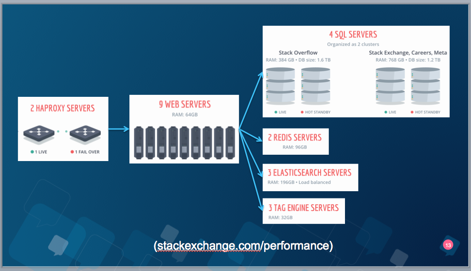

# what is it

__DEV__ elopment __OP__ rations

> DevOps is the practice of operations and development engineers participating together in the entire service lifecycle, from design through the development process to production support.

## goals

* avoid _it works on my machine_
* you built it, you run it
* faster releases
* better cross-team communication
* better software
* code/automate everything

---

# phases

1. plan - what and when will be done,...  
2. code - implement it a submit when tested locally,..  
3. build - continuous delivery,...  
4. test - test everything,...  
5. release - approval, prepare deployment artifacts,...  
6. deploy - configure env, automate deployments, zero-downtime   
7. monitor/operate - proactive actions, scaling,...   
8. move to 1

All this should be a cycle with continuous feedback and shared responsibility

----

# code

----

# build

----

# test

----

#release

----

#deploy

Staged deployments : dev, test ,live
zero-downtime: select group to upgrade->drain them->deploy->select another group->...

---

# deployment plan/Infrastructure

what is going to be deployed where, how is it all connected and how it can adjust to requirements.

* Cloud based, containerized
* physical HW and application deployment

Some concept:

* load balancing

* horizontal scaling(add more boxes)
* orchestration

---

# example SE

---

# XaaS - everything as a service

Cloud deployments on a well managed platform let you deploy faster, scale on demand and optimize cost

* Infrastructure as a service (IaaS)
* Platform as a service (PaaS)
* Software as a service (SaaS)
* others MaaS, CaaS

In order to leverage that, your app needs to designed and packaged in a scalable way

---

# docker

---

# example java workflow

1. code in SCM
1. hook executed on every commit/pr on *master* -> schedule a CI job
1. Jenkins/Travis/CI build the *master*, provides info for SCM
1. everything is green - merge the PR, deploy to staging, problems occurred - fix it & repeat
1. release reached -> new tag/release -> new CI job
1. CI job was ok -> prepare release artifacts for deployment
1. repeat for all stages - dev, test, int-test, pre-flight, live
1. deploy the prepared artifacts, partial rollout,  
